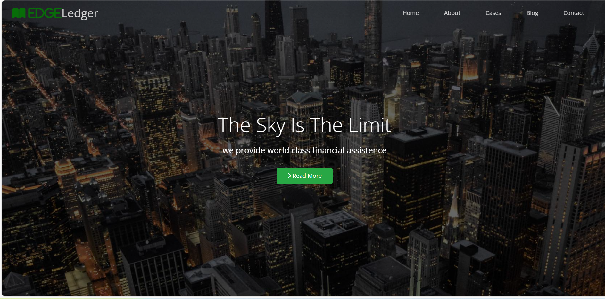
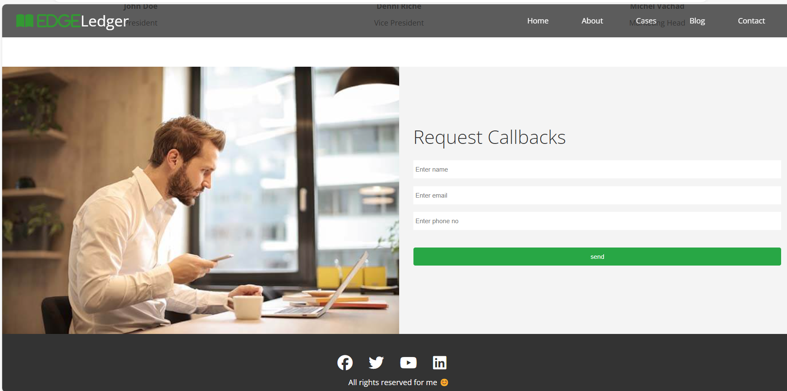

# EdgeLedger – Financial Assistance

EdgeLedger is a responsive website focused on providing financial assistance and guidance to users. Built using HTML, CSS, JavaScript, and jQuery, it offers interactive tools to help users make informed financial decisions.

## 🚀 Features
- **Financial Tools**: Interactive calculators and resources to assist with financial planning.
- **Responsive Design**: Optimized for various devices, ensuring accessibility on desktops, tablets, and smartphones.
- **User-Friendly Interface**: Intuitive navigation and layout for an enhanced user experience.

## 🔠 Built With
- **HTML5**: Structure and content.
- **CSS3**: Styling and layout.
- **JavaScript**: Interactive functionality.
- **jQuery**: Simplified DOM manipulation and event handling.

## 📸 Screenshots

### Home Page


### Financial Tools


### Responsive Design


## 📂 Folder Structure
```
project-root/
├── css/
│   ├── styles.css          # Main stylesheet
├── js/
│   ├── scripts.js          # Main JavaScript file
├── assets/
│   ├── home-page.png       # Screenshot of the home page
│   ├── financial-tools.png # Screenshot of financial tools
│   └── responsive-design.png # Screenshot showcasing responsive design
├── index.html              # Main HTML file
└── README.md               # Project documentation
```

## 🧑‍💻 How to Run the Project

### Clone the repository:
```bash
git clone https://github.com/your-username/edgeledger.git
```

### Navigate to the project directory:
```bash
cd edgeledger
```

### Open `index.html` in your preferred web browser.

## 🌟 Acknowledgments
- Inspired by the need for accessible financial planning tools.
- Thanks to all contributors and users for their valuable feedback.

## ✨ Demo
Add a live demo link here if deployed, e.g., Netlify, Vercel, or GitHub Pages.

